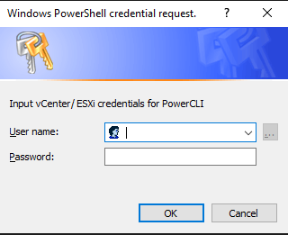

[](https://twitter.com/CrowdStrike)<br/>

# VirtualGHOST

This repository contains a PowerShell script leveraging [VMWare PowerCLI](https://developer.broadcom.com/tools/vmware-powercli/latest) to identify unregistered VMWare Virtual Machines (VMs) that are powered on by comparing the list of VMs registered in the inventory (vCenter or ESXi) vs. those that are powered on.

## What is a VirtualGHOST?

A "VirtualGHOST" is a VMWare Virtual Machine on an ESXi host that has been powered on manually from the command line. CrowdStrike decided to call this particular technique VirtualGHOST since it's a Virtual Machine whose presence is nearly impossible to detect.

## Usage

`Detect-VirtualGHOST.ps1` is the PowerShell script that contains the detection logic. It expects two parameters:
- Server (IP/DNS for vCenter or ESXi)
- Credential (PowerShell credential object representing username/password with privileges to access VMWare management APIs)

If either of these parameters are not provided, the script will prompt for them. E.g.

```
.\Detect-VirtualGHOST.ps1

cmdlet Detect-VirtualGHOST.ps1 at command pipeline position 1
Supply values for the following parameters:
Server:
```



### Passed Credential Object

```powershell
$Credential = Get-Credential
.\Detect-VirtualGHOST.ps1 -Credential $Credential
```

## Tested VMWare Versions

- vCenter 
  - 8.0.2
- ESXi
  - 6.5.0
  - 7.0.3
  - 8.0.0

## Sample Output

### Positive Result Requiring Further Investigation

```
.\Detect-VirtualGHOST.ps1 -Server 192.168.122.20 -Credential $Credential
[+] Importing VMWare PowerCLI module. Please wait as this might take a while...
[+] Connecting to Server: 192.168.122.20
[+] Connected to server: 192.168.122.20
[+] There are 2 hypervisors that will be checked for evidence of VirtualGHOST VMs.
WARNING: [!] ====Unregistered VM Detected on 192.168.122.52====
WARNING:
Hypervisor     VMName   VMConfigFile                                                            VMWorldID
----------     ------   ------------                                                            ---------
192.168.122.52 OpenWrt4 /vmfs/volumes/663a5dbf-a8d1533e-7af4-000c29d0e331/OpenWrt4/OpenWrt4.vmx 265959


WARNING: [!] ====Unregistered VM Detected on 192.168.122.53====
WARNING:
Hypervisor     VMName   VMConfigFile                                                            VMWorldID
----------     ------   ------------                                                            ---------
192.168.122.53 OpenWrt2 /vmfs/volumes/663a5daa-3740eb00-3ac0-000c296d56a6/OpenWrt2/OpenWrt2.vmx 265222


WARNING: This VM appears to be connected to the network(s): VM Network
WARNING:
ActiveFilters DVPortID IPAddress MACAddress        PortID    Portgroup  TeamUplink UplinkPortID vSwitch
------------- -------- --------- ----------        ------    ---------  ---------- ------------ -------
                       0.0.0.0   00:00:00:00:00:00 134217741 VM Network void       0            vSwitch0


WARNING:
Hypervisor     VMName   VMConfigFile                                                            VMWorldID
----------     ------   ------------                                                            ---------
192.168.122.53 OpenWrt5 /vmfs/volumes/663a5daa-3740eb00-3ac0-000c296d56a6/OpenWrt5/OpenWrt5.vmx 266726


WARNING: This VM appears to be connected to the network(s): dvportgroup-20
WARNING:
ActiveFilters DVPortID IPAddress MACAddress        PortID    Portgroup      TeamUplink UplinkPortID vSwitch
------------- -------- --------- ----------        ------    ---------      ---------- ------------ -------
              1        0.0.0.0   00:50:56:98:6f:04 100663310 dvportgroup-20 vmnic1     2248146951   SwitchNetwork


WARNING: [!] Unregistered VMs detected on at least one hypervisor. Please refer to the output above. There may be some false positives due to standard system lifecycles, but any results should be investigated further.
```

### Negative Result - No Potential VirtualGHOST VMs Detected

```
.\Detect-VirtualGHOST.ps1 -Server 192.168.122.20 -Credential $Credential
[+] Importing VMWare PowerCLI module. Please wait as this might take a while...
[+] Connecting to server: 192.168.122.20
[+] Connected to server: 192.168.122.20 | Version: 8.0.2 | ProductLine: vpx
[+] There are 2 hypervisors that will be checked for evidence of VirtualGHOST VMs.
[+] No unregistered VMs detected.
```

## Next Steps

### Imaging / Investigation
Because the VirtualGHOST is not in the VM inventory, it cannot be managed by standard VMWare processes like vCenter or the ESXi web UI. To collect a forensic image and VM log files, follow these steps:

- Enable SSH on the ESXi host with the VirtualGHOST VM (this is required because the Datastore browser may not allow you to copy all of the files related to the VirtualGHOST as some of them will be locked)
- Connect to the ESXi host over SSH
- Copy all files in the VirtualGHOST's directory to a different location (understanding that some files will be locked)
  - Typically there is only one Virtual Machine definition (`.vmx`) file per directory - so navigate to the parent directory of the `VMConfigFile` returned by the detection script
- Register VM in ESXi UI using standard Create/Register VM interface ([Documentation Link](https://knowledge.broadcom.com/external/article?legacyId=1006160))
- Open newly registered VM in ESXi web UI
- Expand all VM menus and capture screenshots for investigative purposes (this can make the job of mapping back specific VM configurations easier)
- Suspend newly registered VM via ESXi web UI
- Copy all files in VM directory to a separate location (noting that this was after registration)

:bulb: The `vmware*.log` files stored in the VM directory will be **extremely** valuable for your investigation, so don't forget to grab/review them!

## Support

As free, as-is tool this software is not officially supported by CrowdStrike. As such we ask that you please refrain from sending inquiries to the CrowdStrike support team. The project maintainers will be working with active community contributors to address bugs and supply new features. If you have identified a bug please [submit an issue through GitHub](https://github.com/CrowdStrike/VirtualGHOST/issues/new).